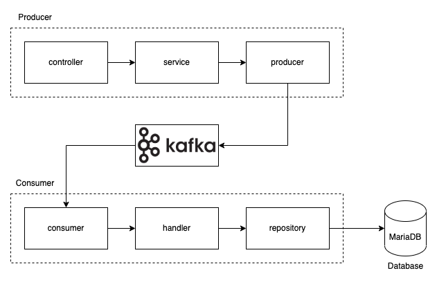

# Banking Kafka

## Architecture



## How to run

1. Install kafka (macOS)
```
$ brew install kafka
```

2. Run docker compose
```
$ docker compose up -d
```

3. Test kafka
```
$ kafka-topics --bootstrap-server=localhost:9092 --list
```

4. Create Topic
```
$ kafka-topics --bootstrap-server=localhost:9092 --topic=songvut --create
```

## Test Consumer with kafka-console-producer

- Subscribe all event topic
```
$ kafka-console-consumer --bootstrap-server=localhost:9092 --include="CloseAccountEvent|DepositFundEvent|OpenAccountEvent|WithdrawFundEvent" --group=log
```

- Send message to topic "OpenAccountEvent" for create bank account
```
$ kafka-console-producer --bootstrap-server=localhost:9092 --topic=OpenAccountEvent
> {"ID": "1", "AccountHolder": "Not", "AccountType": 1, "OpeningBalance": 1000}
```

- Send message to topic "DepositFundEvent" for deposit
```
$ kafka-console-producer --bootstrap-server=localhost:9092 --topic=DepositFundEvent
> {"ID": "1", "Amount": 500}
```

-  Send message to topic "WithdrawFundEvent" for withdraw
```
$ kafka-console-producer --bootstrap-server=localhost:9092 --topic=WithdrawFundEvent
> {"ID": "1", "Amount": 700}
```

- Send message to topic "CloseAccountEvent" for close bank account
```
$ kafka-console-producer --bootstrap-server=localhost:9092 --topic=CloseAccountEvent
> {"ID": "1"}
```

## Producer and Consumer commands

### Consumer

- Consumer: Subscribe topic "songvut"
```
$ kafka-console-consumer --bootstrap-server=localhost:9092 --topic=songvut
```

- Consumer: Subscribe topic with group "notice"
```
$ kafka-console-consumer --bootstrap-server=localhost:9092 --topic=songvut --group=notice
```

- Consumer: Subscribe multi-topic "songvut" and "nakrong"
```
$ kafka-console-consumer --bootstrap-server=localhost:9092
 --include="songvut|nakrong" --group=not
```

### Producer

- Producer: Publish message "hello world"
```
$ kafka-console-producer --bootstrap-server=localhost:9092 --topic=songvut
> hello world
```

## Reference
- [Go Programming - Kafka](https://www.youtube.com/watch?v=RjtIdUOpH04&list=PLyZTXfAT27ib7T9Eg3qhvDE5rgvjQk4OL&index=2)